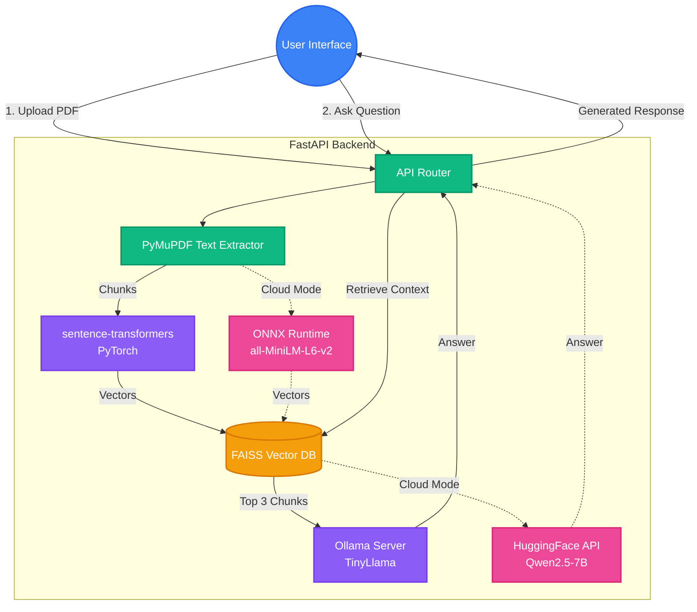

# Local Document Chat - Comprehensive Project Report

## 1. Project Overview
"Local Document Chat" is a privacy-first AI application that allows users to upload PDF documents and interact with them using a conversational RAG (Retrieval-Augmented Generation) pipeline. 

The project solves two distinct deployment scenarios through a **Dual-Mode Architecture**:
1. **Fully Local Mode**: 100% offline and private. Uses local models via Ollama and PyTorch embeddings.
2. **Cloud Mode (HuggingFace Spaces)**: A lightweight deployment that bypasses free-tier resource limits by leveraging HuggingFace's cloud inference APIs.

---

## 2. Technology Stack

### Frontend
- **Framework**: React 18, Vite
- **Styling**: TailwindCSS
- **Key Modules**: 
  - `react-dropzone` (PDF uploading)
  - `lucide-react` (Icons)
  - `react-markdown` (Formatting LLM responses)

### Backend
- **Framework**: FastAPI (Python 3.11)
- **Document Processing**: `PyMuPDF` (`fitz`) for robust text extraction
- **Vector Storage**: `FAISS` (Facebook AI Similarity Search) - runs entirely in-memory/on-disk via CPU

### AI Architecture (Dual-Mode)
| Component | Local Mode | Cloud Mode (HF Spaces) |
|---|---|---|
| **Embeddings** | `sentence-transformers` (PyTorch) | `onnxruntime` + `tokenizers` |
| **Model** | `all-MiniLM-L6-v2` | `all-MiniLM-L6-v2` (ONNX format) |
| **LLM Inference** | Ollama (Local Server) | `huggingface_hub.InferenceClient` |
| **LLM Model** | `tinyllama` | `Qwen/Qwen2.5-7B-Instruct` |

---

## 3. Architecture & Data Flow

### The RAG Pipeline
1. **Upload Phase**:
   - The React frontend sends a PDF file to the FastAPI `/upload` endpoint.
   - `PyMuPDF` extracts the raw text.
   - The text is chunked into overlapping segments of ~600 characters to retain semantic context.
   - The active embedding backend transforms these chunks into 384-dimensional vector embeddings.
   - The vectors are indexed into a local FAISS database and saved to disk.
   
2. **Chat Phase**:
   - The user submits a question to the `/chat` endpoint.
   - The question is converted into an embedding using the identical embedding model.
   - FAISS performs an L2 similarity search to retrieve the top 3 most relevant text chunks.
   - The retrieved chunks and the user's question are formatted into a strict prompt.
   - The prompt is sent to the active LLM backend, generating a contextual response.

### Environment Control
The application automatically selects its mode based on standard environment variables injected at runtime:
- `USE_ONNX=1`: Triggers the lightweight ONNX embedding backend (disables PyTorch).
- `USE_HF_INFERENCE=1`: Routes LLM requests to the HuggingFace API (disables Ollama).
- `HF_TOKEN`: Required for calling HuggingFace inference APIs securely.

---

## 4. Addressing HuggingFace Spaces Deployment Challenges

The transition from a local app to the HuggingFace Spaces free tier (`cpu-basic`: 16GB RAM, 2 vCPU, 50GB storage limit) introduced significant build and execution constraints.

### Challenge 1: Docker Build Size Limits
**Problem**: Bundling PyTorch (~800MB), the `sentence-transformers` library, Ollama (~60MB), and the TinyLlama model weights (~600MB) consistently broke the HuggingFace Docker build pipeline due to container cache size limits.

**Resolution (Embeddings)**: 
The PyTorch dependency was completely stripped from the production Dockerfile. Instead, the application downloads the ONNX-compiled version of the embedding model and executes it using the highly optimized `onnxruntime` library. This reduced the embedding footprint from ~1.2GB to under ~100MB while generating mathematically identical vectors.

### Challenge 2: Local LLM Execution Ceilings
**Problem**: Running a local LLM simultaneously with the user interface and embedding pipeline on 2 vCPUs caused timeouts and out-of-memory errors.

**Resolution (LLM)**:
Ollama was removed from the cloud Docker container entirely. The backend was rewritten to proxy LLM requests to HuggingFace's serverless Inference API. This offloaded the heavy AI generation tasks to HuggingFace's GPU farms, allowing the FastAPI server to run efficiently on minimal CPU.

### Challenge 3: Deprecated Routing URLs (410 Errors)
**Problem**: During testing, models like `zephyr-7b-beta` and `mistral-7b` returned `410 Gone` and `404 Not Found` API errors. This occurred because HuggingFace migrated their serverless architecture from `api-inference.huggingface.co` to `router.huggingface.co`.

**Resolution**:
The raw `requests.post()` HTTP calls were replaced with the official `huggingface_hub.InferenceClient` Python SDK. This library acts as a smart wrapper that automatically resolves the correct internal URLs and handles model routing transparently. The cloud model was successfully pointed to `Qwen/Qwen2.5-7B-Instruct`, stabilizing the deployment completely.

---

## 5. API Endpoints

### `GET /health`
Returns standard JSON `{"status": "ok", "app": "Local Document Chat..."}`. Used by HuggingFace Spaces to determine if the container is ready to accept traffic.

### `POST /upload`
- **Accepts**: `multipart/form-data` with a single `file` field (.pdf).
- **Function**: Processes the PDF, creates the vector index.
- **Returns**: `{"message": "File processed successfully", "chunks": int}`

### `POST /chat`
- **Accepts**: JSON `{"question": "user query string"}`
- **Function**: Performs RAG and queries the LLM.
- **Returns**: `{"answer": "generated text response"}`

---

## 6. How to Run

### Live URL (Cloud Version)
https://yash63663-local-document-chat.hf.space/index.html

### Local Development Version
To run the full privacy-first stack on your local machine:
1. **Start Ollama**: `ollama run tinyllama`
2. **Start Backend**: From `backend/` directory, run `.\venv\Scripts\activate` then `uvicorn main:app --reload --port 8000`.
3. **Start Frontend**: From `frontend/` directory, run `npm run dev` and navigate to `http://localhost:5173`.
